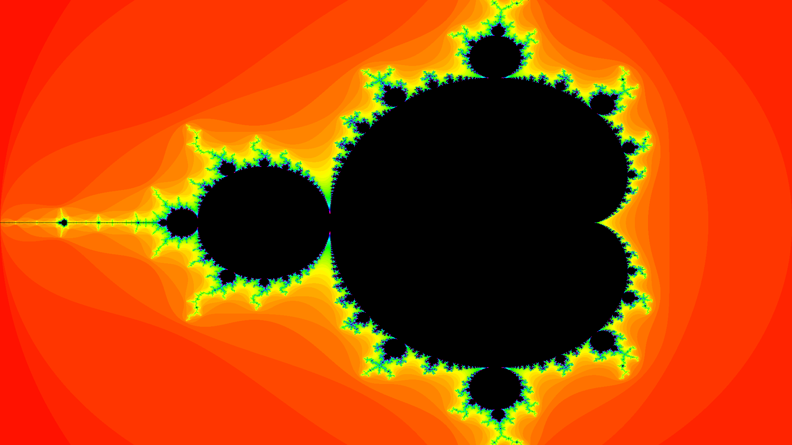
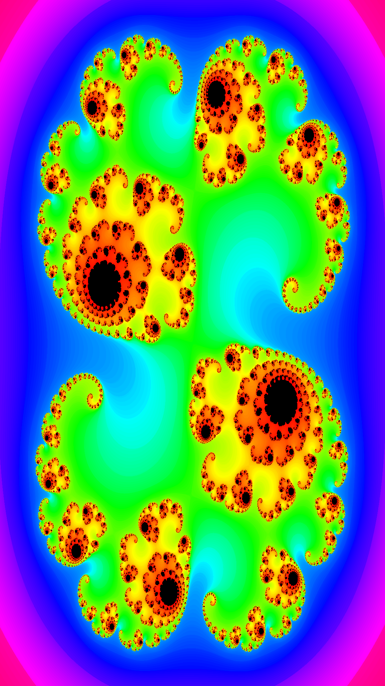

# Mandelbrot-Python
Demonstration of Fractal Mandelbrot developed in Python 3


```python
MAX_ITER = 80
def mandelbrot(c):
    z = 0
    n = 0
    while abs(z) <= 2 and n < MAX_ITER:
        z = z*z + c
        n += 1
    return n
```
Mandelbrot output:


Additional Julia output:

